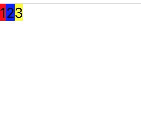
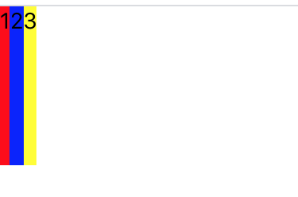
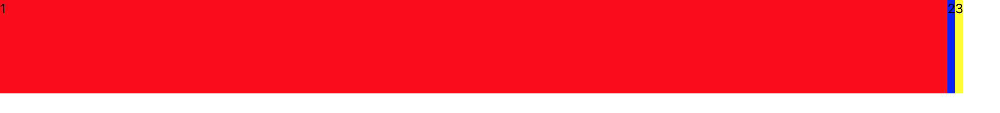
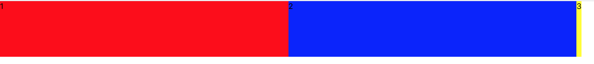
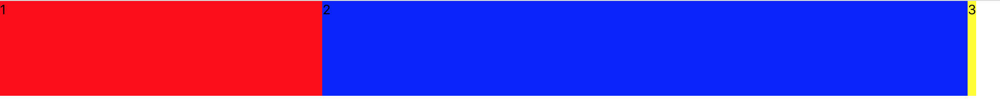
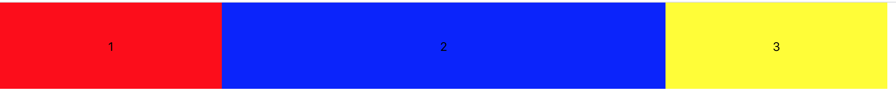

# React Native Test

## How to run?

```
cd newProject1
npm run android -OR- npm start
```

## Tutorial Link

 - https://www.udemy.com/course/react-native-the-practical-guide

## 7. Creating our First React Native App

(Tutorial on https://docs.expo.io/)

1. npm install expo-cli --global (sudo npm install expo-cli --global)
2. expo init my-project
   - blank
   - Enter name, leave slug
   - yarn? choose n to use npm. (usually choose npm)
3. cd my-project
4. npm start

## 8. Working on our First App

 - Now, let's look at App.js

```javascript
export default function App() {
  return (
    <View style={styles.container}>
      <Text>Some Output...</Text>
    </View>
  );  // This is jsx. This will display "Some Output..." on the screen.
}
```

 - If we open the app on Expo, we will see "Some Output..." on the screen.

 - Next, we want to add some state. We will be using a concept called Hook.

```javascript
export default function App() {
  const [outputText, setOutputText] = useState("Default");  // <-- uses a React concept called 'Hook'
  return (
    <View style={styles.container}>
      <Text>{outputText}</Text>
      <Button title="Change Text" onPress={() => setOutputText("Text Changed")}/>
    </View>
  );
}
```

 - As shown in the first comment in the code snippet above, this returns us an outputText(a variable) and setOutputText(a function).
   - we use outputText to display
   - we use setOutputText to change the text
 - We will also modify the jsx slightly to include a button to change the text we display.

## 23. Getting Started with Styles

 - To understand everything, we will start from scratch.

```javascript
import React from 'react';
import { StyleSheet, Text, View, Button, TextInput } from 'react-native';

export default function App() {
  return (
    <View style={{}}>
      <View>
        <TextInput/>
        <Button title="ADD"/>
      </View>
      <View>

      </View>
    </View>
  );
}
```
 - To see what kidn of styles to add to View, refer to this link: https://reactnative.dev/docs/view-style-props

```javascript
<TextInput 
placeholder="Course Goal" 
style={{borderBottomColor: 'black', borderBottomWidth: 1, padding: 10}}/>
<Button title="ADD"/>
```

 - And then, we add a placeholder and style to the text input.


## 24. Flexbox & Layouts (Intro)
 - Every View in React Native uses Flexbox by default (direction set to vertical).
 - Flexbox allow us to lay out components either vertically or horizontally. We can control this using flexDirection.

```javascript
<View style={{flexDirection: 'row', justifyContent: 'space-between', alignItems: 'center'}}>
  <TextInput 
  placeholder="Course Goal" 
  style={{width: '80%', borderBottomColor: 'black', borderBottomWidth: 1, padding: 10}}/>
  <Button title="ADD"/>
</View>
```
 - As shown in code snippet above (in View), we set:
   - flexDirection to 'row': meaning we want to lay out components horizontally.
   - justifyContent to 'space-between': meaning we want all the remaining space to be in between the components. In this case, it makes the textInput and Button on either ends and a huge space in between.
   - alignItems to 'center': this will center things.

 - We will explain these in more details in the next section.

## 25. React Native Flexbox Deep Dive

 - To explain Flexbox more, we will have three boxes.

```javascript
<View style={{flexDirection: 'row'}}>
  <View style={{backgroundColor: 'red'}}>
    <Text>1</Text>
  </View>
  <View style={{backgroundColor: 'blue'}}>
    <Text>2</Text>
  </View>
  <View style={{backgroundColor: 'yellow'}}>
    <Text>3</Text>
  </View>
</View>
```


 - Now, we will add more flexbox configurations.

```javascript
<View style={{flexDirection: 'row', width: '80%', height: 100}}>
  <View style={{backgroundColor: 'red'}}>
    <Text>1</Text>
  </View>
  <View style={{backgroundColor: 'blue'}}>
    <Text>2</Text>
  </View>
  <View style={{backgroundColor: 'yellow'}}>
    <Text>3</Text>
  </View>
</View>
```



 - As you can see, after we added width and height on the parent View style, the child has taken up all of the height, but not all the width (only takes up the minimum width necessary). 
   - This is because there exists a concept of **main axis** and **cross axis**. This is determined by the flexDirection; If flexDirection is row, the main axis is horizontal. vice versa. 
   - By default, components in a View takes up all the cross axis (in this case, the height). But not the main axis (in this case, the width).
     - That being said, we can control how the main axis is distributed via a 'flex' property (explained later).
 - To recap a previous concept in more details:
   - flexDirection: set our main and cross axis.
   - justifyContent: configure child component in main axis.
   - alignitems: configure child component in cross axis.

**Flex Property**

```javascript
<View style={{backgroundColor: 'red', flex: 1}}>
  <Text>1</Text>
</View>
```


 - As you can see, when we add the flex property to the '1' child view, '1' child view takes up all the **remaining space**.

```javascript
<View style={{backgroundColor: 'red', flex: 1}}>
  <Text>1</Text>
</View>
<View style={{backgroundColor: 'blue', flex: 1}}>
  <Text>2</Text>
</View>
``` 



 - As you can see, when we add the flex property with same value to two child views, they share the remaning space.

```javascript
<View style={{flexDirection: 'row', width: '80%', height: 100}}>
  <View style={{backgroundColor: 'red', flex: 1}}>
    <Text>1</Text>
  </View>
  <View style={{backgroundColor: 'blue', flex: 2}}>
    <Text>2</Text>
  </View>
  ```



- As you can see, when we change the '2' child view's flex property to 2, the reamining space shared to '2' is 2/3 of remaining space, and shared to '1' is 1/3. 
   - This is because '1' has flex: 1, 
   '2' has flex: 2.

```javascript
<View style={{backgroundColor: 'red', flex: 1, justifyContent: 'center', alignItems: 'center'}}>
...
<View style={{backgroundColor: 'blue', flex: 2, justifyContent: 'center', alignItems: 'center'}}>
...
<View style={{backgroundColor: 'yellow', flex: 1, justifyContent: 'center', alignItems: 'center'}}>
...
```



 - Lastly, we can tidy it up slightly with justifyContent and alignItems.

## 26. Inline Styles & StyleSheet Objects

 - Using inline styles can be messy as the styles increase. Therefore, we use something called **StyleSheet**.
 - Another advantage is by using StyleSheet, any style errors will be caught and thrown. (whereas inline style errors fail silently).

```javascript
import { StyleSheet, Text, View, Button, TextInput } from 'react-native'; // import StyleSheet.
```

 - First, we need to import StyleSheet.
 - To use stylesheet, we need to create an instance of StyleSheet first: 

```javascript
const styles = StyleSheet.create({
  screen: { // 'screen'' can be any name.
    padding: 50
  },
  inputContainer: {
    flexDirection: 'row', 
    justifyContent: 'space-between', 
    alignItems: 'center'
  },
  textInput: {
    width: '80%',
    borderBottomColor: 'black', 
    borderBottomWidth: 1, 
    padding: 10
  }
})
```
 - 'screen', 'inputContainer' and 'textInput' can be any name.
 - To apply styles, we do this:

```javascript
<View style={styles.inputContainer}>
```

 - To compare, we will show before and after below.

**Before StyleSheet:**

```javascript
<View style={{ padding: 30 }}>
  <View style={{ flexDirection: 'row', justifyContent: 'space-between', alignItems: 'center' }}>
    <TextInput
      placeholder="Course Goal"
      style={{ width: '80%', borderBottomColor: 'black', borderBottomWidth: 1, padding: 10 }} />
    <Button title="ADD" />
  </View>
  <View>
  </View>
</View>
```

**After StyleSheet:**

```javascript
import { StyleSheet, Text, View, Button, TextInput } from 'react-native';
```
```javascript
<View style={styles.screen}>            <!--Added styles here -->
  <View style={styles.inputContainer}>  <!--Added styles here -->
    <TextInput
      placeholder="Course Goal"
      style={styles.textInput} />       <!--Added styles here -->
    <Button title="ADD" />
  </View>
</View>
```
```javascript
const styles = StyleSheet.create({
  screen: { // 'screen'' can be any name.
    padding: 50
  }
  ...
})
```

## 27. Working with State & Events

```javascript
import React, { useState } from 'react';
```

 - First, we need to import useState.

```javascript
const [enteredGoal, setEnteredGoal] = useState('');
```
 - Then, we use useState('') to return a string and a function modify it.
   - enteredGoal is the string/variable to display.
   - setEnteredGoal is a function to set the enteredGoal string/variable.

```javascript
<TextInput
  placeholder="Course Goal"
  style={styles.textInput}
  value={enteredGoal} 
  onChangeText={goalInputHandler} /> 
```
 - Then, we add the 'value' property to TextInput, setting it to enteredGoal. This will display enteredGoal in the TextView.
 - Then, we add the 'onChangeText' property. When we enter a new character into the textInput, it will trigger the function in onChangeText and update the new value to enteredGoal.
   - Note that you **don't need to add parenthesis** to goalInputHandler (explained below), otherwise, this will execute this method when the UI is rendered for the first time.

```javascript
function goalInputHandler(enteredText){ // cleaner code.
  setEnteredGoal(enteredText);
}
```

 - goalInputHanlder is a separate function we write. We use this (almost like a wrapper) instead of setEnteredGoal for cleaner code (incase we need to make additional changes in the future).

**Configuring the ADD button**

 - Next, we add 'onPress' property to the 'ADD' button. When we press this button, the function in onPress will be triggered.

```javascript
<Button title="ADD" onPress={addGoalHandler}/>
```

 - addGoalHandler will add the entered goal(enteredGoal) to the list of goals. But for now, we will simply console.log the enteredGoal.

```javascript
function addGoalHandler(){
  console.log(enteredGoal);
}
```

**Implementing addGoalHandler**

```javascript
const [courseGoals, setCourseGoals] = useState([]);
```

 - First, we define a courseGoals array, and a function to update it.

```javascript
function addGoalHandler(){
  // [...courseGoals] means to copy the courseGoals to this new array. 
  // And ,enteredGoal adds enteredGoal to the new array.
  setCourseGoals([...courseGoals, enteredGoal]);
}
```

 - But this **does not guarantee we get latest courseGoals**.

```javascript
function addGoalHandler(){
  setCourseGoals(currentGoals => [...courseGoals, enteredGoal]);  // arrow function.
}
```

 - We can use anonymous function to guarantee we get the latest courseGoals, because we are passing courseGoals (into anonymous function).

## 28. Outputting a List of Items

```javascript
<View>
  {courseGoals.map((goal) => <Text key={goal}>{goal}</Text>)}
</View>
```

 - In the above code, we take courseGoals and map it to a Text component via arrow function and map(..)
   - Note that we need to add a key prop(property), so React can figure out which Text component to update in the future.
   - We will set key prop to goal for now. WARNING: key prop should be unique. For now, we will assume goal is unique.

## 29. Styling List Items
```js
{courseGoals.map((goal) => <View style={styles.listItem}><Text key={goal}>{goal}</Text></View>)}
```
```js
listItem: {
  padding: 10,
  marginVertical: 10, // margin top and bottom
  backgroundColor: '#ccc',
  borderColor: 'black',
  borderWidth: 1
}
```
 - Add style to View.

```js
{courseGoals.map((goal) => <View key={goal} style={styles.listItem}><Text>{goal}</Text></View>)}
```
 - We need to move the key to the root element (which is the View, not the Text) (Or else, you will get a warning).

## 30. Making it Scrollable with ScrollView!

 - For now, once the number of boxes is more than the page can fit, ti should be scrollable. So, we want to implement this.

```js
import { StyleSheet, Text, View, Button, TextInput, ScrollView } from 'react-native';
...
<ScrollView>
  {courseGoals.map((goal) => <View key={goal} style={styles.listItem}><Text>{goal}</Text></View>)}
</ScrollView>
```
 - We switch from <View> to <ScrollView>

